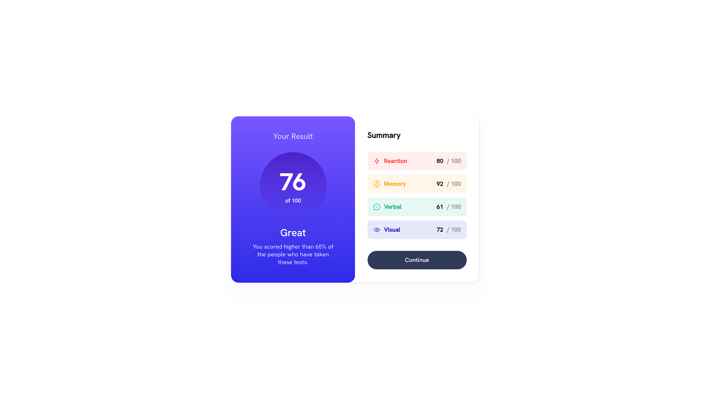
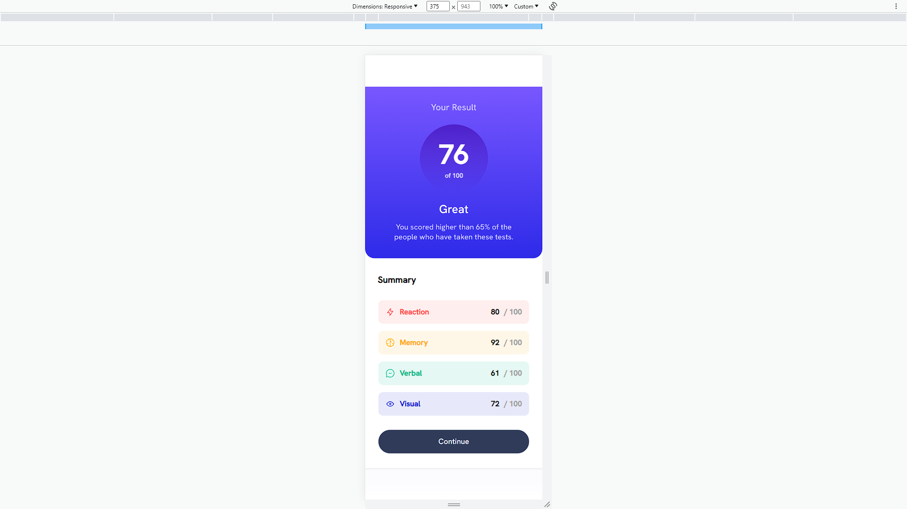

# Frontend Mentor - Results summary component solution

This is a solution to the [Results summary component challenge on Frontend Mentor](https://www.frontendmentor.io/challenges/results-summary-component-CE_K6s0maV). Frontend Mentor challenges help you improve your coding skills by building realistic projects. 

## Table of contents

- [Overview](#overview)
  - [The challenge](#the-challenge)
  - [Screenshot](#screenshot)
  - [Links](#links)
- [My process](#my-process)
  - [Built with](#built-with)
  - [What I learned](#what-i-learned)
  - [Continued development](#continued-development)
  - [Useful resources](#useful-resources)
- [Author](#author)


## Overview

### The challenge

Users should be able to:

- View the optimal layout for the interface depending on their device's screen size
- See hover and focus states for all interactive elements on the page
- **Bonus**: Use the local JSON data to dynamically populate the content

### Screenshot

- Desktop (1440px)


- Mobile (375px)


### Links

- Solution URL: [Add solution URL here](https://your-solution-url.com)
- Live Site URL: [Add live site URL here](https://your-live-site-url.com)

## My process

### Built with

- Semantic HTML5 markup
- CSS custom properties
- Flexbox
- Mobile-first workflow
- Visual Studio Code
- [Styled Components](https://styled-components.com/) - For styles

### What I learned

- CSS Media Query for Mobile

```css
@media (max-width: 375px) {}
```

- CSS Font Face
```css
@font-face {
    font-family: hanken;
    src: url("./assets/fonts/static/HankenGrotesk-Medium.ttf");
}
```

### Continued development

- Semantic HTML5 markup
- CSS Media Query
- CSS Grid
- CSS Animation

### Useful resources

- [Media Queries](https://developer.mozilla.org/en-US/docs/Web/CSS/CSS_media_queries/Using_media_queries) - This helped me for media queries.
- [Media Queries 2](https://www.w3schools.com/css/css_rwd_mediaqueries.asp) - This is an amazing article which helped me finally understand Media Queries. I'd recommend it to anyone still learning this concept.
- [CSS Flex-flow Property](https://www.w3schools.com/cssref/css3_pr_flex-flow.php) - This website is very easy to understand for beginners.


## Author

- Frontend Mentor - [@A-OV](https://www.frontendmentor.io/profile/A0-V)
- Instagram - [@ao.vweb](https://www.instagram.com/ao.vweb/)

